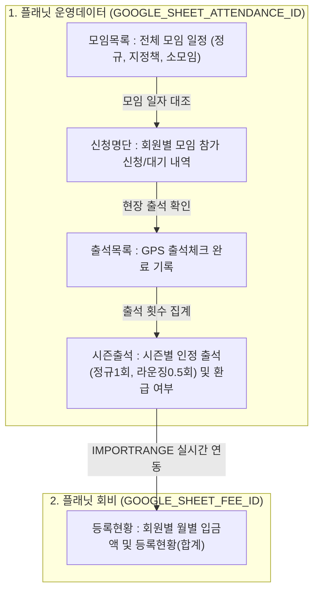

# 🪐 북클럽 플래닛 (Planet) 시스템 아키텍처 요약서

> **문서 목적**: AI 어시스턴트 및 개발자가 시스템의 전체 구조, 데이터 흐름, 구글 시트 연동 방식을 한눈에 파악하여 정확하고 일관된 유지보수를 수행하도록 돕는 기준 문서입니다.

---

## 1. 시스템 개요 (System Overview)

* **프레임워크**: Streamlit (Python 3.11+)
* **데이터베이스(DB)**: Google Spreadsheets (Google Sheets API via `gspread` + Apps Script Webhook)
* **인증 방식**: Google 계정 이메일 기반 화이트리스트 인증 (`회원목록` 시트 대조)
* **시간대 기준**: 대한민국 표준시 (KST, UTC+9) 고정 (`ZoneInfo("Asia/Seoul")`)

---

## 2. 디렉토리 및 모듈별 역할

```
Planet/
├── app.py                     # Streamlit 앱 진입점 (단일 라우터)
├── 바로가기.py                 # 홈 화면 및 주요 기능 퀵 링크 허브
├── styles.py                  # 전역 CSS 스타일 시스템 (모던 플랫, 카드 UI)
├── utils.py                   # 전역 공통 헬퍼 함수 및 서비스 계층 파사드(Facade)
│
├── pages/                     # Streamlit 다중 페이지 라우팅
│   ├── 1_🏠_모임_소개.py
│   ├── 2_👤_회원가입_및_각종_문의.py
│   ├── 3_📅_모임_일정_및_신청.py
│   ├── 4_📍_모임_출석체크.py
│   └── 5_📚_나의_서재_(My_Book_Planet).py
│
├── views/                     # 화면별 UI 렌더링 로직 (Presentation Layer)
│   ├── intro.py               # 모임 소개 뷰
│   ├── register.py            # 회원가입 및 문의 뷰
│   ├── schedule.py            # 모임 일정, 신청/취소, 지난 모임 목록 뷰
│   ├── admin_meeting_create.py# [관리자 전용] 새 모임 개설 폼 뷰 (정규/지정/소모임)
│   ├── attendance.py          # GPS/거리 기반 실시간 모임 출석체크 뷰
│   ├── bookshelf.py           # 회원별 도서 기록 및 감상평 서재 뷰
│   └── calendar_widget.py     # 2609 시즌 인터랙티브 캘린더 위젯
│
├── services/                  # 비즈니스 로직 및 외부 연동 (Business Layer)
│   ├── config.py              # 시트 ID, Webhook URL, 시즌 날짜 설정, GCP 인증 경로
│   └── sheets.py              # gspread 클라이언트, 시트 CRUD, 캐싱, 비동기 통지
│
└── AGENTS.md                  # AI 에이전트 행동 제약 규칙 (외과수술식 최소 개입 원칙)
```

---

## 3. 구글 스프레드시트 데이터베이스 구조

플래닛은 2개의 독립된 스프레드시트를 데이터베이스로 사용합니다.



### 탭별 상세 역할 및 주요 컬럼
1. **`모임목록`**: 모임명, 모임일자, 모임시간, 장소명, 도서명, 저자, 시즌, 정원, 모임설명, 지정책장, 오픈카톡방
   * *규칙*: 날짜를 덮어쓰지 않고, 각 모임은 독립된 행으로 누적 관리됨.
2. **`신청명단`**: 모임명, 모임일자, 회원명, 이메일, 참여방식, 신청일시
3. **`출석목록`**: 모임명, 출석 일시 (KST), 회원 성함, 회원 이메일, 도서명, 라운징 여부(0/1)
4. **`시즌출석`**: 시즌, 성함, 이메일, 회원구분, 환급기준(회), 정규 출석, 라운징, 총 인정 출석, 예치금 환급 여부
5. **`등록현황`**: 회원번호, 이름, 운영진 여부, 26년 9월(D열), ..., 등록현황 합계(H열), 시즌출석달성 유무(J열)
   * *수식 연동*: J열은 `IMPORTRANGE`로 원본 시즌출석 결과를 실시간 수신.
   * *조건부 서식*: J열이 "미달"이면 D열(26년 9월) 셀이 자동으로 **연한 빨간색**으로 채색.
   * *합계 수식*: J열이 "미달"이면 H열 합계에서 20,000원이 **자동 제외(차감)** 처리.

---

## 4. 핵심 데이터 흐름 (Core Workflows)

1. **Google 인증 및 권한 판별**:
   * 유저가 이메일 입력 ➡️ `회원목록` 대조 ➡️ 세션(`st.session_state.google_user`)에 프로필 및 운영진(`is_admin`) 권한 바인딩.
2. **모임 신청 및 취소**:
   * `views/schedule.py` ➡️ `services/sheets.py:add_rsvp` ➡️ 백그라운드 비동기 스레드(`_async_send_post`)로 구글 앱스 스크립트 웹훅에 전송 (사용자 대기시간 0초) ➡️ 캐시 즉시 무효화.
3. **GPS 현장 출석체크**:
   * 브라우저 GPS 좌표 획득 ➡️ 모임 장소와 하버사인(Haversine) 거리 계산 (기본 300m 이내) ➡️ 당일 시간대 검증 ➡️ `append_attendance_to_google_sheet_async`로 출석 기록 저장 ➡️ 시즌 출석 자동 카운트.
4. **모임 일정 자동 분류 (일정 롤링)**:
   * `m_date >= today_date` ➡️ **`📅 예정된 모임`** (정규모임 / 지정책 / 소모임 탭)
   * `today_date - 60일 <= m_date < today_date` ➡️ **`📜 지난 모임`** (완료 배지 표시)

---

## 5. 캐싱 및 성능 최적화 정책

구글 시트 API의 통신 지연(회당 약 2초)을 극복하기 위해 계층화된 캐시를 적용합니다:
* **회원 목록 (`fetch_google_sheet_members`)**: `TTL = 600초 (10분)` (변동 빈도 낮음)
* **모임 목록 (`fetch_google_sheet_meetings`)**: `TTL = 30초`
* **신청 명단 (`fetch_google_sheet_rsvps`)**: `TTL = 30초`
* **출석 목록 (`fetch_google_sheet_attendances`)**: `TTL = 30초`
* **데이터 변경 즉시 동기화**: 모임 개설/삭제, 신청/취소, 출석 완료 시 해당 캐시의 `.clear()`를 즉시 호출하여 화면에 실시간 반영 보장.

---

## 6. 개발 및 코드 수정 시 절대 준수 원칙

1. **외과수술식 최소 개입**: 사용자가 요청한 특정 파일, 특정 범위만 수정하며 주변 코드 리팩토링이나 추측성 기능 추가를 엄격히 금지함.
2. **제안과 실행의 분리**: 더 좋은 구조나 아이디어가 있더라도 코드를 먼저 작성하지 않고 텍스트로 1~2줄 제안 후 사용자 승인을 받음.
3. **[AGENTS.md](file:///c:/Users/pile1/OneDrive/%EB%B0%94%ED%83%95%20%ED%99%94%EB%A9%B4/workspace/Planet/AGENTS.md) 참조**: 작업 전 반드시 루트의 규칙 파일을 준수하여 작업 범위를 한정함.
